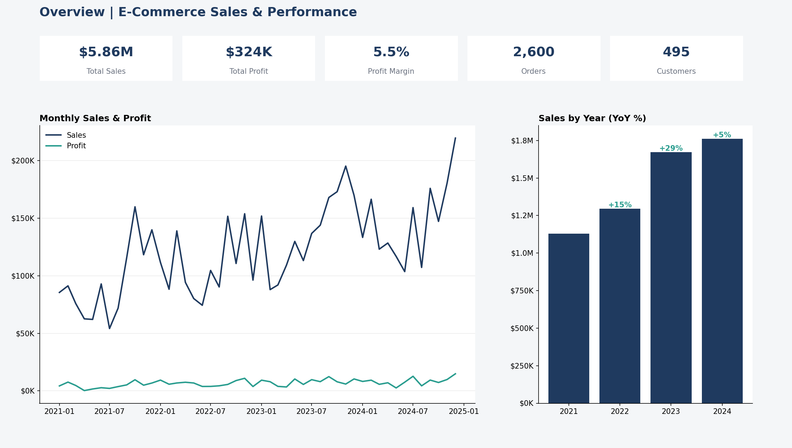
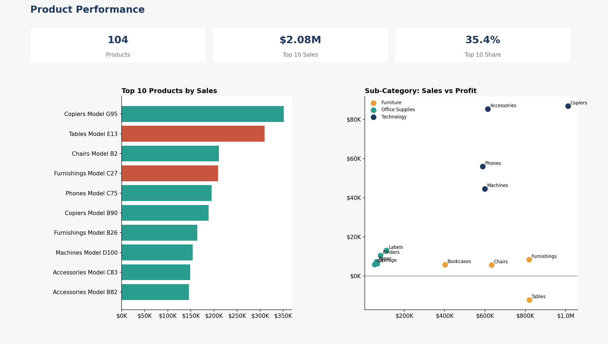
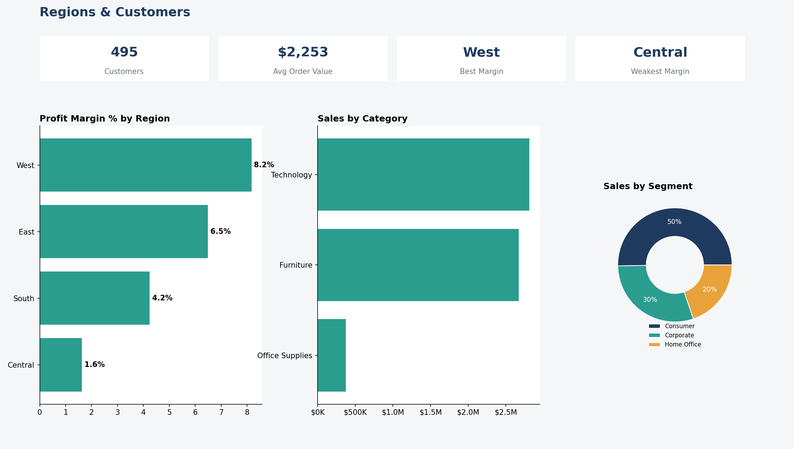

# E-Commerce Sales Dashboard

I built this Power BI project to practise the full workflow: cleaning data in Power Query, setting up a star schema, and writing DAX measures to answer basic sales questions. It looks at sales, profit and customers across 4 regions and 3 product categories.





Made with Power BI, Excel, Power Query and DAX.

## The data

The file in `data/raw` is a made-up dataset in the Sample Superstore layout, about 4,800 order lines from 2021 to 2024. I left some mess in it on purpose: 25 duplicate rows, extra spaces in customer names and 15 orders with no state.

## Cleaning in Power Query

The queries are in the `powerquery` folder. `orders_raw.m` loads the sheet and `orders.m` does the cleaning: fixes data types, trims text, drops the duplicate rows, fills the missing states with "Unknown" and adds a `Days To Ship` column. Customers, products and the date table each get their own query.

If you open it yourself, name the queries `Orders_Raw`, `Orders`, `Customers`, `Products` and `Date`, and turn off load for `Orders_Raw`. Change the file path in `orders_raw.m` to wherever you put the Excel file.

## Model and measures

It's a simple star schema. Orders is the fact table and connects to Customers, Products and Date. The measures are in `dax/measures.dax`: sales, profit, margin, orders, customers, year over year growth, YTD, top 10 share and repeat customers.

## What I found

- Total sales were $5.86M with $324K profit, a 5.5% margin
- The top 10 products bring in 35.4% of revenue (out of 104 products)
- West has the best margin at 8.2% and Central the worst at 1.6%
- Furniture barely breaks even at 0.3%, while Office Supplies is at 11.7%
- Sales grew 14.6% in 2022, 29.0% in 2023 and only 5.4% in 2024
- Orders with a 30% discount lose money (-7.2% margin), while orders with no discount make 10.5%

The discount result is the one I'd act on first. Capping discounts around 20% would likely help, especially in Central where the margin is already thin.

## Files

```
data/raw/      Excel source file
powerquery/    M queries
dax/           measures
screenshots/   report previews
```
